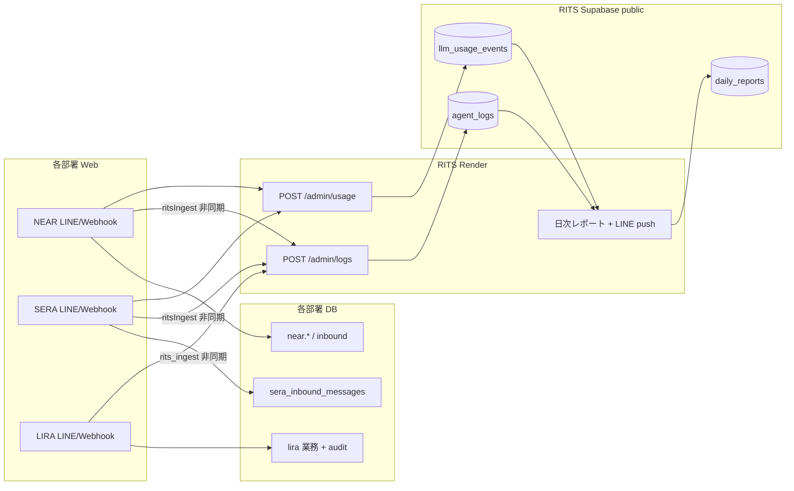

# ワークスペース引き継ぎ — Veliora 会話・LLM を RITS 日次監査に載せる

**作成日**: 2026-05-23  
**対象読者**: NEAR / SERA / IRIE / LRAM / RITS を横断して実装する別ワークスペース  
**正典（監査主体）**: RITS（本リポ）。顧客マスタ正本: `docs/customer-master-design.md`（`veriora.customers`）

---

## 0. 背景（いま起きていること）

2026-05-23 の日次 LINE push で次が確認された。

| 現象 | 原因（確定） |
|------|----------------|
| **同じ日次レポートが2通**（スコア 95 / 85 など差あり） | **Cron**（`rits-daily-owner-push`）と **Web 内スケジューラ**が同時に `POST /admin/reports/daily/push-owner` を実行。`daily_reports.owner_line_pushed_at` **列なし**（migration **005 未適用**）で二重防止が効かない |
| **会話ログが極端に少ない**（NEAR 1、他 0） | 日次の「会話ログ N件」は **`public.agent_logs` のみ**を数える。本番の実会話は `sera_inbound_messages` 等にあり、**RITS に `POST /admin/logs` されていない** |
| **LLM 0回** | `llm_usage_events` **未作成**（017 未適用）または各部署の `VERIORA_RITS_*` 未設定 |

**RITS 側のコード修正（済 / 要デプロイ）**

- Render 上で `DAILY_OWNER_PUSH_ENABLED` 未設定時は **Web スケジューラを起動しない**（Cron に任せる）
- 同一プロセス内の `push-owner` 同時実行を **in-flight で直列化**

---

## 1. ゴール / 非ゴール

### ゴール

1. **各部署の LINE（等）会話**が、返信完了後に **非同期で** `POST /admin/logs` され、日次レポートの「24h 活動」に反映される
2. **LLM usage** が `POST /admin/usage` され、日次の「LLM N回 / tok」に反映される
3. **日次 push は1通/日**（005 適用 + Web スケジューラ off + Cron のみ）
4. （任意 Phase B）過去 N 日分の **バックフィル**で `agent_logs` を埋める
5. （任意 Phase C）**顧客マスタ**は NEAR / `veriora` 側。RITS は参照のみ（`customer-master-design.md`）

### 非ゴール（この設計ではやらない）

- RITS を **CRM / ユーザー台帳の正本**にしない
- `agent_logs` に PII を増やしすぎない（原文全量の無制限複製は避ける）
- NEAR / SERA の **業務テーブル構造の破壊的変更**

---

## 2. データの流れ（目標像）



**原則**

- **正本**: 会話の実体は各部署 DB（＋将来 `veriora.messages`）
- **監査用コピー**: `public.agent_logs`（RITS が日次・LINE コマンドで読む）
- **転送失敗**しても各部署の LINE 返信は成功させる（ベストエフォート）

---

## 3. RITS API 契約（実装済み・変更不要）

### 3.1 会話ログ

```
POST https://rits-gj2m.onrender.com/admin/logs
x-admin-api-key: <RITS の ADMIN_API_KEY と同値>
Content-Type: application/json
```

```json
{
  "agent_name": "NEAR",
  "user_message": "（ユーザー発話・最大目安 4k 文字）",
  "agent_reply": "（AI 返信・最大目安 6k 文字）",
  "intent": "optional_intent_key",
  "confidence": 0.85,
  "source": "line",
  "metadata": {
    "line_user_id": "Uxxxx",
    "conversation_key": "optional",
    "legacy_table": "near_inbound_messages",
    "legacy_row_id": 123
  }
}
```

| フィールド | 必須 | 備考 |
|------------|------|------|
| `agent_name` | ○ | **`NEAR` / `SERA` / `IRIE` / `LRAM`**（registry の `code` と一致） |
| `user_message` / `agent_reply` | 推奨 | 空だと監査品質が落ちる |
| `source` | 任意 | 既定 `line`。`render-verify` 等のテストは本番で送らない |
| `metadata` | 任意 | **冪等・追跡用**。後述の `rits_log_key` を推奨 |

**冪等（推奨・各部署で実装）**

- `metadata.rits_log_key` = 安定 ID（例: `near:inbound:109`, `sera:inbound:109`）
- RITS 側 Phase 2 候補: `metadata->>'rits_log_key'` の UNIQUE インデックス（未実装。まずは部署側で重複 POST を避ける）

### 3.2 LLM usage

詳細: [`llm-usage-api-planned.md`](./llm-usage-api-planned.md)

```
POST /admin/usage
```

各部署の `recordLlmUsage()` から自動 POST する想定（既存パターン）。

### 3.3 監査（手動・バッチ）

```
POST /admin/audit/run
{ "agent_name": "SERA", "limit": 20 }
```

日次レポートとは別。`agent_audits` を溜めたいときに実行。

---

## 4. 各部署でやること（チェックリスト）

### 4.1 共通 — Render 環境変数

各部署の **Web サービス**（LINE Webhook が動くサービス）に追加:

| Key | Value |
|-----|--------|
| `VERIORA_RITS_BASE_URL` | `https://rits-gj2m.onrender.com` |
| `VERIORA_RITS_ADMIN_API_KEY` | RITS Dashboard の `ADMIN_API_KEY` と **同じ** |

一括設定スクリプト（RITS リポ）: `scripts/render-set-veriora-rits-env.sh`  
（`RENDER_API_KEY` + 兄弟リポの `.env` パスが必要）

**検証**

```bash
# 部署側から（鍵は Render の値）
curl -sS -X POST "$VERIORA_RITS_BASE_URL/admin/logs" \
  -H "content-type: application/json" \
  -H "x-admin-api-key: $VERIORA_RITS_ADMIN_API_KEY" \
  -d '{"agent_name":"NEAR","user_message":"ingest-test","agent_reply":"ok","source":"workspace-verify"}'
```

RITS Supabase `agent_logs` に1行増えること。

### 4.2 NEAR（秘書部）

**探すファイル（目安）**

- `ritsIngest` / `verioraRits` / `POST /admin/logs` で grep
- LINE 返信成功 **後**のフック（`replyMessage` 直後、イベント処理の末尾）

**実装要件**

1. 返信テキスト確定後、`void ingestToRits(...)`（**await しない**）
2. payload: `agent_name: "NEAR"`, `user_message`, `agent_reply`, `intent`, `source: "line"`
3. `metadata`: `line_user_id`, `near_inbound_messages.id` 等
4. 失敗時: 部署ログに `warn` のみ（ユーザーには見せない）

**既にコードがある場合**

- Render に `VERIORA_RITS_*` が入っているかだけ確認（整合性監査: コード済・**env 要確認**）

### 4.3 SERA（マーケ部）

NEAR と同様。`agent_name: "SERA"`。  
データ元: `sera_inbound_messages`（本番 Supabase で行が存在することを確認済み）。

### 4.4 IRIE（経理部）

Python: `rits_ingest.py` 等。`agent_name: "IRIE"`。  
Sheets 正の業務と LINE 会話の両方がある場合は **LINE 応答パスのみ**でも可（段階導入）。

### 4.5 LRAM（編集部）

会話があれば `LRAM`。未稼働ならスキップ可。

---

## 5. RITS / Supabase でやること

### 5.1 migration（SQL Editor で順に）

| ファイル | 目的 |
|----------|------|
| `005_daily_reports_owner_line_pushed.sql` | **日次 LINE 二重 push 防止** |
| `017_llm_usage_events.sql` | LLM 集計 |

既存: `001`–`004` 適用済みであること（`/health/supabase-tables` で確認）。

### 5.2 Render（RITS Web）

| Key | 推奨値 |
|-----|--------|
| `DAILY_OWNER_PUSH_ENABLED` | **`false`** または未設定（Cron のみ） |
| `LINE_OWNER_USER_ID` | オーナー LINE ID |
| `NODE_ENV` | `production` |

### 5.3 Render（Cron）

- スケジュール: `0 0 * * *`（UTC）= JST 9:00
- `ADMIN_API_KEY`, `RITS_RENDER_URL`, `APP_BASE_URL` を Web と一致

### 5.4 デプロイ

- `main` に `ownerDailyPushService` の Render デフォルト修正が入ったら **Web を redeploy**

---

## 6. 受け入れ条件（Done の定義）

### A. 日次 push

- [ ] JST 9:00 前後に **1通だけ** 日次レポートが届く
- [ ] Render Web ログに **「日次オーナーLINE push: スケジューラ起動」が無い**（または `DAILY_OWNER_PUSH_ENABLED=false`）
- [ ] Cron ログ: `status 200`, `pushed: true`, **`idempotency_recorded: true`**（005 適用後）

### B. 会話ログ

- [ ] 各部署で実 LINE 1往復後、24h 以内に `agent_logs` が **+1**（`source` が `line` 系）
- [ ] 日次レポートの【24h 活動】が **手動 verify テスト以外**でも増える
- [ ] `metadata.rits_log_key` または legacy id で **重複行が増えない**

### C. LLM

- [ ] `017` 適用後、usage POST で `llm_usage_events` に行が増える
- [ ] 日次に「記録なし」以外が出る（利用がある日）

### D. 回帰

- [ ] 各部署 LINE 返信 latency が **転送追加前と同程度**（非同期のため ±数百 ms 以内が目安）
- [ ] RITS `/webhook/line` は従来どおり（オーナー向け RITS ボット）

---

## 7. 検証手順（コピペ用）

### 7.1 RITS Supabase — 件数確認

```bash
# service_role で REST（鍵は Dashboard から）
curl -sS "$SUPABASE_URL/rest/v1/agent_logs?select=agent_name,created_at,source,user_message&order=created_at.desc&limit=20" \
  -H "apikey: $SUPABASE_SERVICE_ROLE_KEY" \
  -H "Authorization: Bearer $SUPABASE_SERVICE_ROLE_KEY"
```

### 7.2 日次を手動生成（push しない）

```bash
curl -sS -X POST "$RITS_URL/admin/reports/daily" \
  -H "content-type: application/json" \
  -H "x-admin-api-key: $ADMIN_API_KEY" \
  -d '{}'
```

### 7.3 push 手動（テスト）

```bash
npm run render:push-daily-owner --prefix /path/to/RITS
# 2回目はスキップされること（005 適用後）
```

---

## 8. Phase B — バックフィル（任意）

**目的**: 過去会話を `agent_logs` に載せ、日次の「0件」感を減らす。

| 項目 | 方針 |
|------|------|
| 対象 | 直近 7〜14 日、`sera_inbound_messages` / `near.near_inbound_messages` 等 |
| 実装場所 | **各部署リポ**に one-off スクリプト（RITS に集約しない） |
| レート | `POST /admin/logs` を **1 req/s 以下**、バッチ 200 件/実行 |
| 本文 | 長文は **先頭 4k / 6k で truncate**（RITS 監査と同じ） |
| 冪等 | 必ず `metadata.rits_log_key` |

---

## 9. Phase C — 顧客マスタ（別トラック）

ユーザー情報の正本は **RITS ではなく** `veriora.customers` 系。

- 設計: [`customer-master-design.md`](./customer-master-design.md)
- RITS: 日次レポートに **要約セクションを足す**程度（`VERIORA_CUSTOMER_AUDIT_IN_DAILY_REPORT` 等・既存フラグあり）
- **LINE の「会話ログ件数」と混同しない**

---

## 10. Phase D — RITS が DB を直接読む（将来）

`db-conventions.md` の「中期」:

- `veliora.line_message_events` / `veriora.messages` を **読み取り専用**で日次集計
- 部署の `ritsIngest` と **二重カウント**しないよう、どちらか一方を正とするフラグが必要

**この Phase は ingest が安定してから。**

---

## 11. リポジトリ・サービス ID（参照）

| 部署 | GitHub（例） | Render service ID（2026-05 時点） |
|------|----------------|-----------------------------------|
| RITS | kazz-0818/RITS | Web `srv-d829vcd7vvec73b48org`, Cron `crn-d87u9k6q1p3s73fmutk0` |
| NEAR | （兄弟リポ） | `srv-d827s21j2pic73b3457g` |
| SERA | | `srv-d827p4mgvqtc73denm60` |
| LIRA | | `srv-d829fi3eo5us7386o5cg` |
| LRAM | | `srv-d879fflckfvc73a1fm90` |

Supabase プロジェクトは **RITS の `SUPABASE_URL` と各部署が同一か**を必ず確認。別プロジェクトだと `agent_logs` だけ増えて部署 DB と一致しない。

---

## 12. ワークスペース向け最初のタスク分解

| 順 | タスク | リポ | 見積 |
|----|--------|------|------|
| 1 | Supabase **005 + 017** 適用 | RITS / 共通 DB | 15分 |
| 2 | RITS Web redeploy + `DAILY_OWNER_PUSH_ENABLED=false` 確認 | RITS | 15分 |
| 3 | 各部署 Render に `VERIORA_RITS_*` | NEAR/SERA/IRIE/LRAM | 30分 |
| 4 | `ritsIngest` の呼び出し有無を grep → 無ければ LINE 返信後に追加 | 各部署 | 1〜2h/部署 |
| 5 | 実 LINE 1往復 → `agent_logs` 増加確認 | 結合 | 30分 |
| 6 | 翌朝 9:00 **1通**確認 | 運用 | — |
| 7 | （任意）バックフィルスクリプト | 各部署 | 2h |

---

## 13. 関連ドキュメント

- [veriora-architecture.md](./veriora-architecture.md) — 監査と正典の分離
- [db-conventions.md](./db-conventions.md) — `agent_logs` と Veliora ログの関係
- [render-cron-setup.md](./render-cron-setup.md) — Cron / env
- [veriora-consistency-audit.md](./veriora-consistency-audit.md) — 組織整合性監査（最新 SHA は都度更新）

---

## 14. このリポで未コミットの修正

別ワークスペースが pull する前に、RITS `main` に以下が入っているか確認:

- `src/services/ownerDailyPushService.ts` — Render 未設定時スケジューラ off、push in-flight 直列化
- `README.md` — `DAILY_OWNER_PUSH_ENABLED` の説明更新

未デプロイなら **RITS Web を redeploy** してから各部署の ingest 検証に進むこと。
